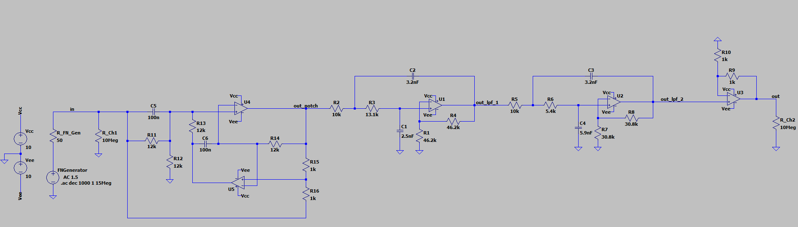
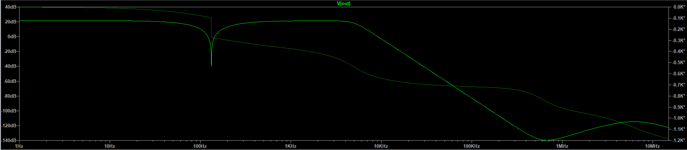

# Microphone-Pre-Amp-Noise-Filter
This project implements a cascaded analog filter system consisting of:
1. A bandstop (notch) filter to suppress an unwanted 120 Hz interference tone
2. A 4th-order Butterworth low-pass filter (LPF) to limit bandwidth and prevent aliasing before sampling or further digital processing
___
### Design and Testing
The design was simulated and analyzed in **LTspice** using Bode magnitude and phase plots to verify frequency-domain performance and phase behavior. Both the complete circuit and the magnitude/phase response can be seen below:

___
### Notch Filter
The notch filter utilized is a Fliege notch filter. The reason as to why the Fliege notch filter was used was the advantages offered as stated in Texas Instruments' "High-speed notch filters" written by Bruce Carter. As stated in the [document](https://www.ti.com/lit/an/slyt235/slyt235.pdf "High-speed notch filters"):
1. Only four precision components: two Rs and two Cs, are required for tuning the center frequency. One nice feature of this circuit is that slight mismatches of components are okay; the center frequency will be affected, but not the notch depth.
2. The Q of the filter can be adjusted independently from the center frequency by using two noncritical resistors of the same value
3. The center frequency of the filter can be adjusted over a narrow range without seriously eroding the depth of the notch.

As seen in the magnitude response picture above, it is clear that the notch filter does a good job in filtering the 120Hz tone.

___
### Low Pass Filter
The low pass filter is a 4th order Butterworth filter used as an anti-aliasing filter to prepare the signal for an analog-to-digital converter.

The pass-band of the filter is 300 Hz to 5 kHz, and it is generally flat to 2 dB (excluding the 120 Hz tone filtered out previously). Based off the specifications, the order for the Butterworth filter (chosen for its simplicity) was derived to be 4.

The electronic design is based off the 2nd Sallen and Key stage design (i.e k = 2). All R and C values were derived via deriving the 4th order system equation and the k = 2 S&K design parameters.

The buffer amplifier (i.e gain of 1 apmplifier) at the end prevents the load from changing the filter’s frequency response and ensures the filter behaves exactly as designed. In essence, the buffer amplifier guarantees the filter response is independent of the following part of the circuit (in this case, an ADC).